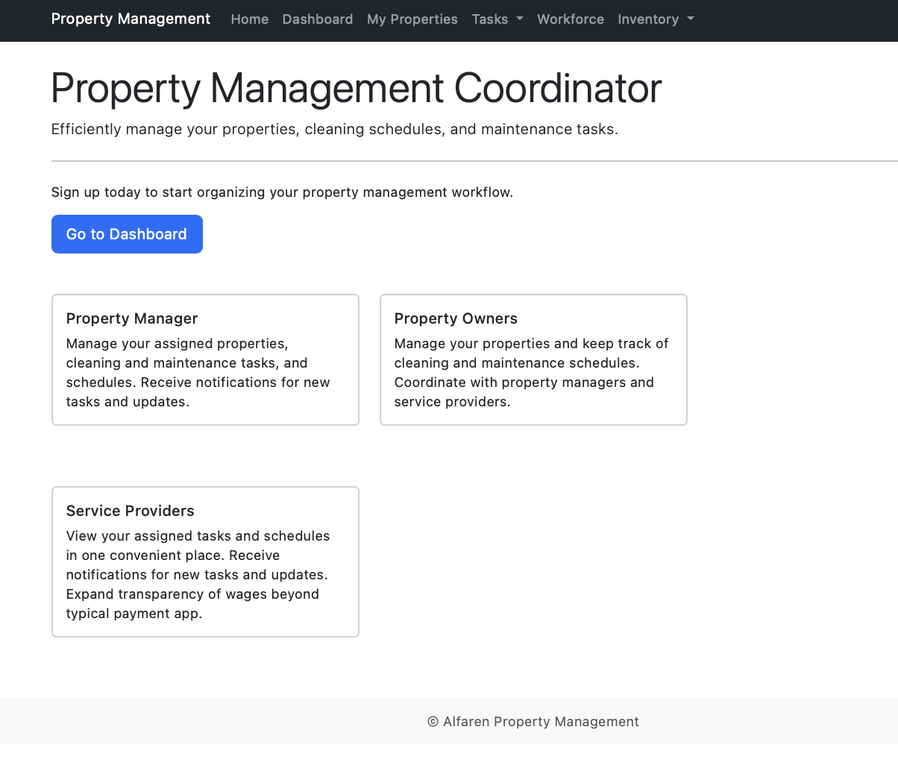
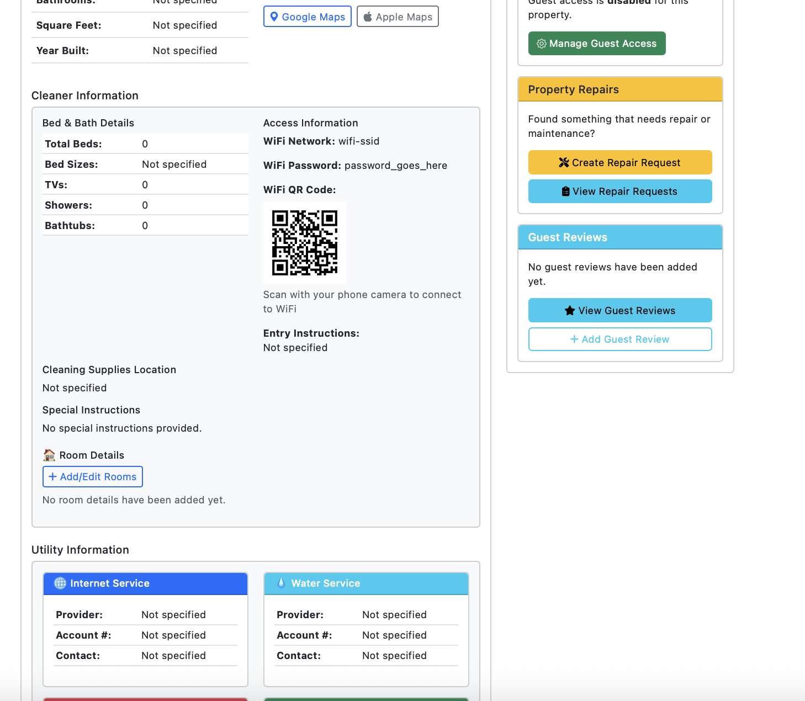

# Short Term Land Lord

A comprehensive property management system designed specifically for short-term rental properties. This platform streamlines the coordination between property owners, cleaners, and maintenance staff while providing enhanced calendar integration with popular booking platforms like Airbnb and VRBO.

## Features



- **Calendar Management**: Import and sync calendar events from Airbnb, VRBO, and other booking platforms
- **Property Management**: Track property details, amenities, and access information
- **Task Management**: Assign and track cleaning and maintenance tasks
- **User Role System**: Different interfaces and permissions for property owners, cleaners, and maintenance staff
- **Inventory Management**: Track supplies and assets for each property
- **Cleaning Sessions**: Document cleaning with before/after videos and photos
- **Maintenance Requests**: Report and track maintenance issues
- **Guest Access Portal**: Provide information to guests with customizable access



## Development Setup

### Prerequisites

- Git
- Docker and Docker Compose (recommended)
- If not using Docker, you will need Python 3.9+ and PostgreSQL

### Docker Setup (Recommended)

1. Clone the repository:
   ```bash
   git clone https://github.com/gitayam/short_term_land_lord.git
   cd short_term_land_lord
   ```

2. Copy the example environment file:
   ```bash
   cp .env.example .env
   nano .env
   ```

3. Configure your environment variables in `.env`:
   ```
   FLASK_APP=app.py
   FLASK_ENV=development
   DATABASE_URL=postgresql://postgres:postgres@db:5432/stll_db
   SECRET_KEY=your_secret_key
   ```

4. Build and start the containers:
   ```bash
   docker-compose up -d --build
   ```

5. Access the application at http://localhost:5001

### Local Installation (Alternative)

1. Clone the repository and create a virtual environment:
   ```bash
   git clone https://github.com/gitayam/short_term_land_lord.git
   cd short_term_land_lord
   python3 -m venv venv
   source venv/bin/activate  # On Windows: venv\Scripts\activate
   ```

2. Install dependencies:
   ```bash
   pip install -r requirements.txt
   ```

3. Configure your environment (see Docker setup step 2-3)

4. Initialize the database:
   ```bash
   flask db upgrade
   ```

5. Run the application:
   ```bash
   flask run
   ```

## Development Workflow

### Database Management

The application uses PostgreSQL and follows these practices:

- Development environment uses Docker volumes for persistence
- Database can be reset using: `docker-compose down --volumes && docker-compose up -d`
- Migrations are stored in the `migrations/` directory
- New migrations can be created with: `flask db migrate -m "Description"`
- Apply migrations with: `flask db upgrade`

### Running Tests

```bash
# Ensure your virtual environment is activated
python3 -m pytest tests/
```

### Project Structure

```
.
├── app/                    # Main application package
│   ├── models/            # Database models
│   ├── templates/         # Jinja2 templates
│   ├── static/           # Static assets
│   └── views/            # Route handlers
├── migrations/            # Database migrations
├── tests/                # Test suite
├── docs/                 # Documentation
├── docker-compose.yml    # Docker services configuration
├── Dockerfile           # Application container definition
└── requirements.txt     # Python dependencies
```

## Calendar Integration

The system supports calendar integration with various booking platforms. For detailed setup instructions, see [README_CALENDARS.md](README_CALENDARS.md).

Key features include:
- Multi-platform calendar sync (Airbnb, VRBO, Booking.com)
- Automated synchronization
- Visual booking management
- Platform-specific color coding

## User Guides

### Property Owner

As a property owner, you can:

- **Dashboard**: View an overview of all properties, upcoming bookings, and pending tasks
- **Property Management**: Add and edit property details, amenities, and access information
- **Calendar**: Import and view bookings from various platforms (Airbnb, VRBO, etc.)
- **Tasks**: Create cleaning and maintenance tasks, assign them to staff
- **Inventory**: Track supplies and assets for each property
- **Reports**: View cleaning session reports and maintenance history
- **Guest Access**: Configure guest access portal with property-specific information

### Cleaner

As a cleaner, you can:

- **Dashboard**: View your upcoming cleaning assignments
- **Cleaning Sessions**: Start/end cleaning sessions with before/after documentation
- **Checklists**: Follow property-specific cleaning checklists
- **Inventory**: Report low inventory items
- **Issues**: Report maintenance issues discovered during cleaning
- **History**: View your completed cleaning sessions and feedback

### Maintenance Staff

As maintenance staff, you can:

- **Dashboard**: View maintenance requests assigned to you
- **Requests**: Accept, update, and complete maintenance requests
- **Documentation**: Upload photos of repairs and maintenance work
- **Tasks**: View recurring maintenance tasks assigned to you
- **History**: Track your completed maintenance tasks

### Guest Access

Guests with a property-specific access link can:

- View property details and photos
- Access check-in and check-out instructions
- Find WiFi information
- View house rules and emergency contacts
- Discover local attractions and recommendations

## Contributing

1. Fork the repository
2. Create a feature branch: `git checkout -b feature-name`
3. Commit your changes: `git commit -m 'Add some feature'`
4. Push to the branch: `git push origin feature-name`
5. Submit a pull request

## License

This project is licensed under the MIT License - see the LICENSE file for details.
