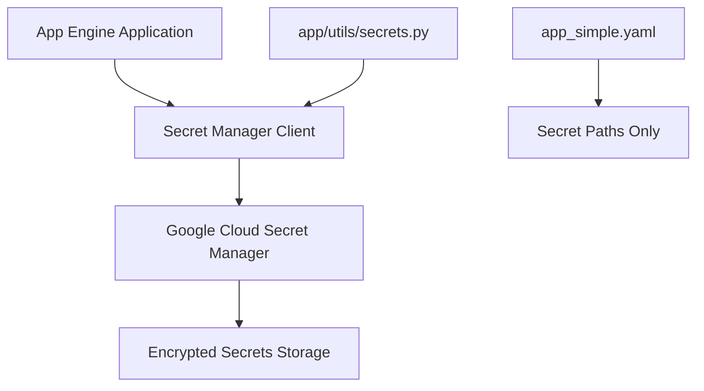

# 🔐 Secrets Management with Google Cloud Secret Manager

This document describes how the Short Term Landlord application securely manages sensitive configuration using Google Cloud Secret Manager.

## Overview

Instead of hardcoding sensitive values like passwords, API keys, and database credentials in configuration files, we use Google Cloud Secret Manager to store and retrieve secrets securely.

### Benefits
- ✅ **Security**: Secrets are encrypted at rest and in transit
- ✅ **Rotation**: Easy to update secrets without redeploying
- ✅ **Audit**: Full audit trail of secret access
- ✅ **Versioning**: Keep multiple versions of secrets
- ✅ **Access Control**: Fine-grained IAM permissions

## Architecture



## Current Implementation

### Secrets Stored
- `SECRET_KEY` - Flask application secret key (auto-generated)
- `ADMIN_EMAIL` - Default admin user email
- `ADMIN_PASSWORD` - Default admin user password (auto-generated)

### Configuration Files

**app_simple.yaml** - Only contains paths to secrets, not the secrets themselves:
```yaml
env_variables:
  # Secret Manager paths (application will fetch these)
  SECRET_KEY_PATH: "projects/speech-memorization/secrets/SECRET_KEY/versions/latest"
  ADMIN_EMAIL_PATH: "projects/speech-memorization/secrets/ADMIN_EMAIL/versions/latest"
  ADMIN_PASSWORD_PATH: "projects/speech-memorization/secrets/ADMIN_PASSWORD/versions/latest"
```

**app/utils/secrets.py** - Handles secret retrieval with fallbacks:
```python
from app.utils.secrets import get_app_secrets
secrets = get_app_secrets()
app.config['SECRET_KEY'] = secrets['SECRET_KEY']
```

## Setup Commands

### 1. Create Secrets (One-time setup)

```bash
# Create a secure random Flask SECRET_KEY
gcloud secrets create SECRET_KEY --data-file=- <<< "$(openssl rand -base64 32)"

# Create admin email
gcloud secrets create ADMIN_EMAIL --data-file=- <<< "admin@your-domain.com"

# Create secure admin password
gcloud secrets create ADMIN_PASSWORD --data-file=- <<< "$(openssl rand -base64 16)"
```

### 2. View Existing Secrets

```bash
# List all secrets
gcloud secrets list

# View secret metadata (not the value)
gcloud secrets describe SECRET_KEY

# View secret versions
gcloud secrets versions list SECRET_KEY
```

### 3. Update Secrets

```bash
# Add new version of a secret
gcloud secrets versions add SECRET_KEY --data-file=- <<< "new-secret-value"

# Add from file
echo "new-admin-password" | gcloud secrets versions add ADMIN_PASSWORD --data-file=-
```

### 4. Access Secrets (for debugging)

```bash
# View current secret value (be careful - this exposes the secret!)
gcloud secrets versions access latest --secret="SECRET_KEY"

# View specific version
gcloud secrets versions access 1 --secret="ADMIN_PASSWORD"
```

## Use Cases

### 1. Rotating Admin Password

```bash
# Generate new password and update secret
NEW_PASSWORD=$(openssl rand -base64 16)
echo "$NEW_PASSWORD" | gcloud secrets versions add ADMIN_PASSWORD --data-file=-

# The application will use the new password on next restart/request
# No redeployment needed!
```

### 2. Adding New Secrets

```bash
# Create new secret for database password
gcloud secrets create DATABASE_PASSWORD --data-file=- <<< "$(openssl rand -base64 24)"

# Update app_simple.yaml to include the path
# Update app/utils/secrets.py to retrieve it
# Redeploy application
```

### 3. Environment-Specific Secrets

```bash
# Create production secrets
gcloud secrets create PROD_SECRET_KEY --data-file=- <<< "$(openssl rand -base64 32)"

# Create staging secrets  
gcloud secrets create STAGING_SECRET_KEY --data-file=- <<< "$(openssl rand -base64 32)"

# Use different paths in different app.yaml files
```

### 4. Sharing Secrets Between Services

```bash
# Create shared database credentials
gcloud secrets create SHARED_DB_PASSWORD --data-file=- <<< "shared-password"

# Grant access to multiple service accounts
gcloud secrets add-iam-policy-binding SHARED_DB_PASSWORD \
    --member="serviceAccount:service1@project.iam.gserviceaccount.com" \
    --role="roles/secretmanager.secretAccessor"

gcloud secrets add-iam-policy-binding SHARED_DB_PASSWORD \
    --member="serviceAccount:service2@project.iam.gserviceaccount.com" \
    --role="roles/secretmanager.secretAccessor"
```

## Security Best Practices

### 1. Principle of Least Privilege
```bash
# Grant minimal permissions - only secret accessor, not admin
gcloud secrets add-iam-policy-binding SECRET_KEY \
    --member="serviceAccount:short-term-landlord@speech-memorization.iam.gserviceaccount.com" \
    --role="roles/secretmanager.secretAccessor"
```

### 2. Secret Rotation Schedule
```bash
# Set up automatic rotation (example with Cloud Scheduler)
gcloud scheduler jobs create http secret-rotation-job \
    --schedule="0 2 * * 0" \
    --uri="https://your-app.com/rotate-secrets" \
    --http-method=POST
```

### 3. Audit Access
```bash
# View who accessed secrets
gcloud logging read "resource.type=gce_instance AND protoPayload.serviceName=secretmanager.googleapis.com"
```

## Troubleshooting

### Common Issues

1. **Permission Denied**
   ```bash
   # Check IAM permissions
   gcloud secrets get-iam-policy SECRET_KEY
   
   # Add missing permissions
   gcloud secrets add-iam-policy-binding SECRET_KEY \
       --member="serviceAccount:your-service@project.iam.gserviceaccount.com" \
       --role="roles/secretmanager.secretAccessor"
   ```

2. **Secret Not Found**
   ```bash
   # Verify secret exists
   gcloud secrets describe SECRET_KEY
   
   # Check path in app.yaml matches actual secret name
   ```

3. **Fallback Values Used**
   ```bash
   # Check application logs
   gcloud app logs read -s short-term-landlord | grep -i secret
   
   # Verify Secret Manager client initialization
   ```

### Debug Commands

```bash
# Test secret access from Cloud Shell
gcloud secrets versions access latest --secret="SECRET_KEY"

# Verify service account has access
gcloud secrets get-iam-policy SECRET_KEY

# Check application logs for secret-related errors
gcloud app logs read -s short-term-landlord --limit=100 | grep -E "(secret|Secret|SECRET)"
```

## Alternative: GitHub Secrets

For GitHub Actions CI/CD, you can also store secrets in GitHub:

```bash
# Set GitHub secrets using gh CLI
gh secret set GCLOUD_SERVICE_KEY < service-account-key.json
gh secret set SECRET_KEY --body "$(openssl rand -base64 32)"

# Use in GitHub Actions
- name: Deploy to App Engine
  env:
    SECRET_KEY: ${{ secrets.SECRET_KEY }}
  run: gcloud app deploy
```

## Migration from Hardcoded Values

1. **Identify hardcoded secrets** in your codebase
2. **Create secrets** in Secret Manager
3. **Update configuration** to use secret paths
4. **Modify application code** to retrieve from Secret Manager
5. **Test thoroughly** with fallback values
6. **Deploy** and verify secret retrieval
7. **Remove** hardcoded values from code

## Monitoring and Alerting

```bash
# Create alert for secret access failures
gcloud alpha monitoring policies create --policy-from-file=secret-alert-policy.yaml

# Monitor secret usage
gcloud logging metrics create secret_access_metric \
    --description="Secret Manager access attempts" \
    --log-filter="resource.type=secretmanager.googleapis.com"
```

---

**Security Note**: Never commit actual secret values to version control. Always use Secret Manager paths in configuration files and retrieve secrets at runtime.